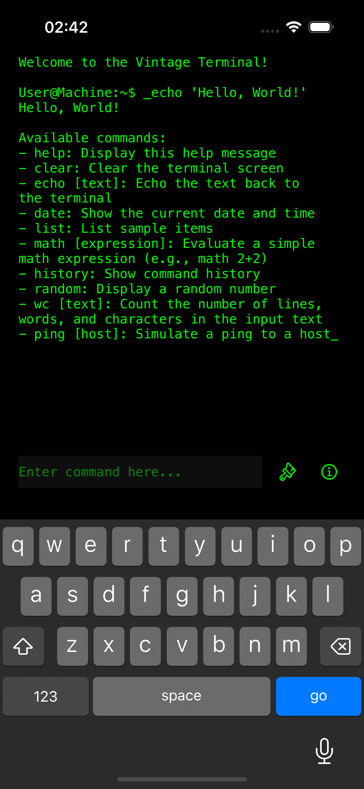
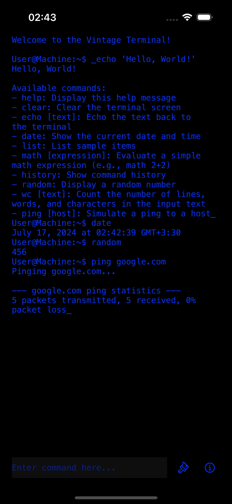

# RetroTermX

RetroTermX is an iOS project designed to emulate a vintage terminal experience, providing users with a command-line interface. Developed in Swift using UIKit, the app offers a variety of commands and features to recreate the charm of classic computing.

### Photos Sample

 

## Features

- **Simulated Terminal Environment:** Experience the look and feel of a vintage terminal.
- **Typing Animation:** Watch as text appears on the screen character by character.
- **Color Customization:** Change the terminal text color with a simple button tap.
- **Command Processing:** Execute various predefined commands to interact with the terminal.
- **Command History:** Access previously entered commands.

## Installation

1. Clone the repository:
    ```bash
    git clone https://github.com/aidinahmadian/RetroTermX.git
    ```

2. Navigate to the project directory:
    ```bash
    cd RetroTermX
    ```

3. Open the project in Xcode:
    ```bash
    open RetroTermX.xcodeproj
    ```

4. Build and run the project on your preferred iOS simulator or device.

## Usage

### Terminal Commands

RetroTermX supports the following commands:

- `help`: Display a list of available commands.
- `clear`: Clear the terminal screen.
- `echo [text]`: Display the provided text in the terminal.
- `date`: Show the current date and time.
- `list`: Display a list of sample items.
- `math [expression]`: Calculate a simple math expression (e.g., `math 2+2`).
- `history`: Show the history of entered commands.
- `random`: Generate and display a random number.
- `wc [text]`: Count the number of lines, words, and characters in the input text.
- `ping [host]`: Simulate a dummy network ping to a specified host.

### Interface Overview

- **Terminal View:** The main interface where you can input commands and see the output.
- **Change Color Button:** Tap to cycle through different text colors for the terminal.
- **Navigate Button:** Tap to access the "About" section.

## Contributing

Contributions are welcome! To contribute:

1. Fork the repository.
2. Create a new branch:
    ```bash
    git checkout -b feature/your-feature-name
    ```
3. Make your changes and commit them:
    ```bash
    git commit -m "Add your commit message"
    ```
4. Push to your branch:
    ```bash
    git push origin feature/your-feature-name
    ```
5. Create a pull request.

## License

This project is licensed under the MIT License. See the [LICENSE](LICENSE) file for more details.

## Contact

Created by Aidin. For more information, visit [my GitHub profile](https://github.com/aidinahmadian).

---

Feel free to reach out with any questions or feedback!
